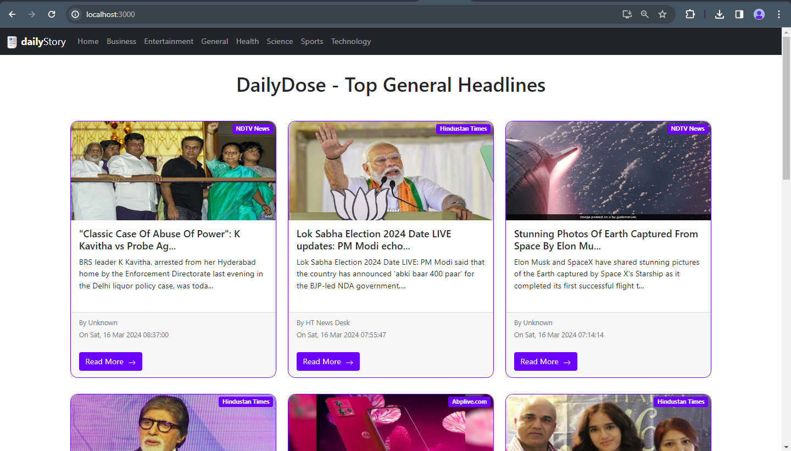

# dailyStory - Dynamic News Aggregator with Category Filtering
The dailyStory App is a cutting-edge news aggregator created with MERN Stack that harnesses the capabilities of modern technology to fetch real-time news articles from diverse sources via APIs. Going beyond basic news apps, dailyStory offers users the ability to explore news stories based on categories of their interest, ensuring a tailored and comprehensive news consumption experience.

# Preview

# Key Features:
- **Real-time News Aggregation:** The heart of the dailyStory app lies in its real-time news fetching mechanism, powered by API integration. This ensures that users receive the latest news articles from reliable sources.

- **User-Friendly Interface:** The app boasts an intuitive and visually appealing user interface that makes browsing and reading news articles a seamless and enjoyable experience.

- **Categorized News:** dailyStory categorizes articles into various categories such as Politics, Technology, Sports, Entertainment, and more. This empowers users to explore news that aligns with their interests.

- **Category Filtering:** A standout feature of the app is its ability to filter news articles based on user-selected categories. Users can focus on specific topics, enhancing their news consumption efficiency.

- **Customizable Preferences:** Users can personalize their news feed by choosing their favorite categories and sources. This feature tailors the app to individual preferences.

- **Detailed Article Views:** News articles open in a dedicated view, displaying the article content, images, and links. Users can delve into stories without distractions.

- **Search Functionality (Future Enhancement):** The app includes a search feature that allows users to look up specific news topics, keywords, or articles.

- **Dark Mode (Future Enhancement):** Another potential future feature could involve the implementation of a dark mode for comfortable reading in low-light conditions.

# Potential Use Cases:
- News enthusiasts seeking a comprehensive and organized source of current affairs.
- Students and professionals staying informed about industry-specific news.
- Users looking to explore news from various perspectives by filtering by category.
- Commuters and travelers catching up on news articles on the go.

The dailyStory App emerges as a standout news aggregator that combines real-time news updates with tailored content consumption. By categorizing and filtering news articles, it provides a personalized and efficient way for users to stay informed about topics that matter most to them. With its potential for future enhancements, dailyStory has the potential to revolutionize the way users engage with and consume news in a digital age.

# To See and Feel what it's Like
**1. Clone this repo**
> $ git clone https://github.com/neelmani-u/dailyStory

**2. Run the following command in your project directory**
> $ cd dailyStory

> $ npm install

**3. How to launch**
> $ npm run both

**4. Open http://localhost:3000/ or http://127.0.0.1:3000/ using your web browser**

